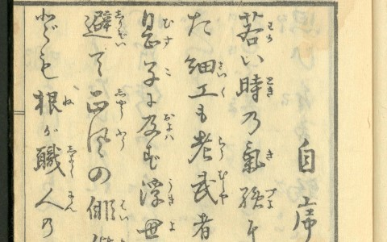
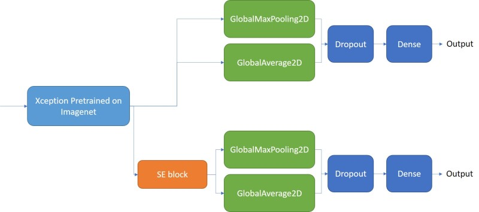

# Kaggle Kuzushiji Recognition

- [Project Overview](#project-overview)
    - [Detection Part](#detection-part)
    - [Classification Part](#classification-part)
    - [Results](#results)
- [Our Environments](#our-environments)
    - [Libraries](#libraries)
    - [Hardware](#hardware)
- [Instructions](#instructions)
    - [Detection](#detection)
    - [Classification](#classification)
- [License](#license)

## Project Overview

This repo contains the jupyter notebook solution of [kuzushiji recognition](https://www.kaggle.com/c/kuzushiji-recognition/overview), we separate the recognition task into the detection part and the classification part.

### Detection Part

We use **Faster RCNN** based on **Pytorch**, this part is based on [kaggle-kuzushiji-2019](https://github.com/lopuhin/kaggle-kuzushiji-2019) by **lopuhin**. This part only need to detect words, it does not have to predict the class the words, so only one class is used.

### Classification Part

Classification task is done with a slightly modified **Xception** model. The model has two separated branches,  the architecture is shown in the picture below. **SE block** is [Squeeze-and-Excitation]((https://arxiv.org/abs/1709.01507)). We use **Keras** to implement this model.

### Results

Both the detection model and the classification model are trained about 20 epochs on 1 1080ti GPU. Since I can only use my PC to train model, so I did not train them with more epochs. These trained models can be download at the Instructions part below.

| Public Score | Private Score |
|--------------|---------------|
| 0.850        | 0.851         |

## Our Environments

Python 3.7.1 (I think 3.6 is also fine)

### Libraries

- tensorflow-gpu==2.0.0
- torch==1.3.0
- jupyter==1.0.0
- albumentations==0.4.2
- imgaug==0.2.6
- opencv-python==4.1.1
- scikit-learn
- scikit-image

You can also refer to `requirements.txt`.

### Hardware

- Nvidia GeForce GTX 1080ti 12 GB * 1
- 32 GB RAM

## Instructions

### Detection
1. Download the [kuzushiji dataset](https://www.kaggle.com/c/kuzushiji-recognition/data).  Unzip the folder and place it in the repo, at location `path/to/kaggle-kuzushiji/input`. Take ``train_images.zip`` for example, it should be something like `path/to/kaggle-kuzushiji/input/train_images/xxx.jpg`.
2. Run `detection.ipynb` to train the detection model. You can also download the [trained model](https://drive.google.com/open?id=1P0PwO1ZDh-bfY-cH4-0I374ZWNdheSlX) and place it in `models/detection`, then directly run the `Test set prediction` part in the last part of the notebook to detect words in the test set, it will output a csv file.
3. Run `crop_detection.ipynb` to crop and save the detected words, or you can download cropped word images [here](https://www.kaggle.com/henry32144/kuzushiji-cropimage) (at the Output Files section), then unzip them at location `path/to/kaggle-kuzushiji/input`, it should look like `path/to/kaggle-kuzushiji/input/cropped/test_xxxxxx/images`.

### Classification
4. Download the [cropped training images](https://www.kaggle.com/christianwallenwein/kuzushiji-characters), unzip them at location `path/to/kaggle-kuzushiji/input`.
5. Run `cls_train.ipynb` to train the classification model, or download the [trained model](https://drive.google.com/open?id=1kOR2HWQ9sSH-KRqclkeaW3i3rq1geN0J) and place it in `models/classification`.
6. Run `cls_predict.ipynb` to predict.

## License

files in the `faster_rcnn` folder and `detection.ipynb` are under BSD 3-Clause License. Other files are under MIT License.